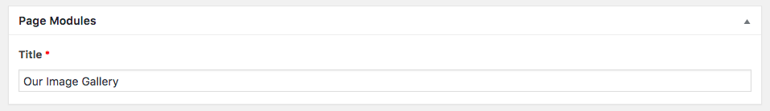

# 2. Adding ACF Fields and Manipulating Data

This tutorial covers:
- [2.1 Adding ACF Fields](#21-adding-acf-fields)
- [2.2 Adding a Field Group](#22-adding-a-field-group)
- [2.3 Displaying Content with `$data()`](#23-displaying-content-with-data)
- [2.4 Understanding the Flynt Data Flow](#24-understanding-the-flynt-data-flow)
- [2.5 Taking our Module Further](#25-taking-our-module-further)

**A requirement of this tutorial is using the Wordpress Plugin [Advanced Custom Fields (ACF)](https://www.advancedcustomfields.com/). Please make sure this is installed and enabled before continuing.**

## 2.1 Adding ACF Fields
To get started, we will add a text field for our title. Create the `Modules/ImageSlider/fields.json` file and add the code below to it:

```json
{
  "fields": [
    {
      "name": "title",
      "label": "Title",
      "type": "text",
      "required": 1
    }
  ]
}
```

The folder structure will now resemble the following:

```
- flynt-theme
| - Modules
  | - ImageSlider
    | - fields.json
    | - index.php.pug
```

That's all we need to do to register a new field.

This functionality is driven by the Advanced Custom Fields (ACF) Wordpress plugin, and there are many other field types available. Flynt supports all of the field types provided by ACF, as well as all of the default field options as provided by the plugin. To see the full list of available fields and their available options, check out the [official ACF documentation here](https://www.advancedcustomfields.com/resources/#field-types).

<!-- - Extra: Add fields quicker using our acf-field-snippets. For atom + sublime text. Coming soon?! -->

Before we can use these fields to add content, we first need to let Flynt know in which situations these fields should be available to the editor in the backend.

## 2.2 Adding a Field Group

All field group configuration files can be found in the `config/fieldGroups` directory. For this tutorial we will modify the default `pageModules` configuration. Open `config/fieldGroups/pageModules.json` and replace the contents with the following:

```json
{
  "name": "pageModules",
  "title": "Page Modules",
  "fields": [
    "Flynt/Modules/ImageSlider/Fields"
  ],
  "location": [
    [
      {
        "param": "post_type",
        "operator": "==",
        "value": "page"
      }
    ]
  ]
}
```

<!-- TODO: explain the fields/modules/imageslider/fields line.  -->

Here we are setting the location where the field group should be displayed to the "Page" post type.

As with the field settings, we are writing our location rules using the configuration options provided by Advanced Custom Fields. To read more about this, check out the [official ACF documentation on location rules](https://www.advancedcustomfields.com/resources/custom-location-rules/).

That's it! Navigate to the backend of your Wordpress installation and create a new page. At the bottom, you'll now see a new section for your Image Slider module with a field labeled "Title" inside.



Add "Our Image Gallery" into the title text field and press the "Update" button in the top right to save this content to the page. Next, we'll move on to displaying this content on the front-end.

## 2.3 Displaying Content with `$data()`
Open up the `Modules/ImageSlider/index.php.pug` we made in the previous section.

We can now display the title using the `$data()` function. This function takes the name of your field as a parameter and returns the value.

```jade
div(is='flynt-image-slider')
  .slider
    h1.slider-title= $data('title')
```

## 2.4 Understanding the Flynt Data Flow

At this point it is important to understand how this data is passed to the view "Behind the scenes". In actual fact, the data function uses the data passed to the template referenced by its keys. This can be understood much easier with the flowchart below:

```
 Insert the goods here ;)

[ template configuration ]

[ ParentData? ]

[ InitialModuleConfig? ]

[ DataFilters + DataFilterArgs ]

[ CustomData ]

[ modifyModuleData filter ]

[ pass data to template ]

[ rendered html ]
```

To dig into this more, read through the full flowchart in the [Flynt Plugin documentation](/add-link).

## 2.5 Taking our Module Further
Since we are making an image slider, let's also add a gallery field to our module, again using the `field.json` file:

```json
{
  "fields": [
    {
      "name": "title",
      "label": "Title",
      "type": "text",
      "required": 1
    },
    {
      "name": "images",
      "label": "Images",
      "type": "gallery",
      "mime_types": "jpg, jpeg",
      "required": 1
    },
  ]
}
```

Open up your page in the backend and you will now see our new gallery field, with the label "Images". Add some sample images to the field and save your page. For ease, we have prepared some images that you can [download here](/add-link). (Source: [Unsplash](https://unsplash.com).)

In `Modules/ImageSlider/index.php.pug`, we can now loop over our images, again using the `$data` function to output our data.

```jade
div(is='flynt-image-slider')
  .slider
    h1.slider-title= $data('title')
    .slider-items
      for image in $data('images')
        .slider-item
          img(src=$data(image, 'url'))
```

---

## Next Steps

We now have a simple module that takes data from our fields and outputs them on the front-end!

But what if we want do pull other data in our module? The next section explores passing additional data to our module using DataFilters.

**[Go to Section Three](datafilters.md)**
